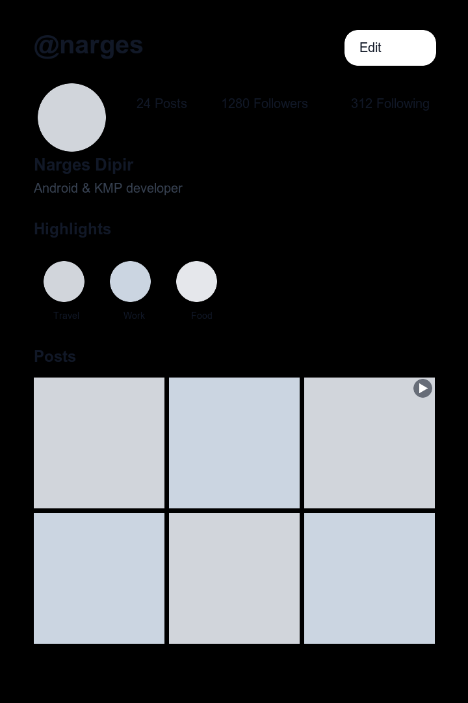

# Instagram Clone (KMP)

A Kotlin Multiplatform Instagram-style clone targeting Android and iOS with shared UI using Compose Multiplatform.

## Preview
<p align="center">
  
</p>

## Features
- Profile screen with editable profile data (username, full name, bio, website)
- Instagram-like highlights strip with gradient story rings
- Clickable highlights with story viewer behavior
- Multi-image highlight stories with:
  - horizontal swipe pager
  - tap-left / tap-right navigation
  - auto-advance progress bars
- Post grid with image + video posts
- Post detail screen with:
  - Android/iOS video playback
  - like and comment actions
  - local-only persistence for likes/comments (no server write)
- Firebase push notification plumbing on Android + iOS (token + incoming event bridge to shared code)

## Data Source
- App reads profile data from GitHub Pages JSON:
  - `mock-api/v1/profile.json`
- If you change mock data locally, push/deploy to GitHub Pages so devices load the latest payload.

## Project Structure
- `composeApp/src/commonMain` shared UI/domain/data logic
- `composeApp/src/androidMain` Android-specific implementations (video player, back handler)
- `composeApp/src/iosMain` iOS-specific implementations (video player, back handler)
- `iosApp` iOS app entry project for Xcode
- `mock-api` JSON payload used by remote profile API

## Build
### Android
```bash
./gradlew :composeApp:assembleDebug
```

### iOS (Kotlin framework compile)
```bash
./gradlew :composeApp:compileKotlinIosSimulatorArm64
```

### Tests
```bash
./gradlew :composeApp:testDebugUnitTest
```

## Benchmark Manual
### Prerequisites
1. Connect a physical Android device (recommended for macrobenchmarks).
2. Enable in Developer Options:
   - `USB debugging`
   - `Install via USB`
   - `USB debugging (Security settings)` (if your ROM shows it)
3. Keep the phone unlocked while benchmarks install/run.

### Main Commands
1. Run robustness benchmark and export metrics to a stable text report:
```bash
./gradlew :benchmark:runInstalledRobustnessWithMetrics
```
2. Open the latest robustness metrics:
```bash
open benchmark/build/reports/androidTests/connected/benchmark/robustness-metrics-latest.txt
```
3. Run connected benchmark suite (Gradle HTML report flow):
```bash
./gradlew :benchmark:connectedBenchmarkAndroidTest
```
4. Open Gradle connected test report:
```bash
open benchmark/build/reports/androidTests/connected/benchmark/index.html
```

### Output Files
- Robustness metrics text report (recommended source of truth):
  - `benchmark/build/reports/androidTests/connected/benchmark/robustness-metrics-latest.txt`
- Archived robustness reports:
  - `benchmark/build/reports/androidTests/connected/benchmark/robustness-metrics-YYYYMMDD-HHMMSS.txt`
- Gradle connected benchmark HTML:
  - `benchmark/build/reports/androidTests/connected/benchmark/index.html`

### Troubleshooting
1. `INSTALL_FAILED_USER_RESTRICTED`
   - Cause: device blocked ADB app install.
   - Fix: enable `Install via USB`, approve on-device prompts, keep device unlocked, rerun benchmark.
2. `DEBUGGABLE` in macrobenchmark
   - Cause: wrong tested variant/task.
   - Fix: run `:benchmark:connectedBenchmarkAndroidTest` (benchmark variant), not debug Android test task.
3. `index.html` shows `0 tests` but benchmarks ran
   - Cause: HTML report reflects a failed Gradle install session.
   - Fix: use `robustness-metrics-latest.txt` for actual run metrics.

## Tech Stack
- Kotlin Multiplatform
- Compose Multiplatform
- Koin
- Ktor
- Coil 3
- Media3 (Android video)
- AVPlayerViewController (iOS video)
- Firebase Cloud Messaging (push)

## Firebase Push Setup (Android + iOS)
1. Create a Firebase project and add both apps:
   - Android package: `de.app.instagram`
   - iOS bundle ID: your `iosApp` bundle id from Xcode
2. Android setup:
   - Download `google-services.json`
   - Place it at `composeApp/google-services.json`
   - Build and run Android app, allow notification permission when prompted (Android 13+)
3. iOS setup (Xcode):
   - Add Firebase SDK packages (`FirebaseCore`, `FirebaseMessaging`) to `iosApp`
   - Download `GoogleService-Info.plist` and add it to `iosApp/iosApp`
   - Enable capabilities on app target:
     - Push Notifications
     - Background Modes -> Remote notifications
   - Configure APNs key/certificate in Firebase Console (Cloud Messaging tab)
4. Send a test push from Firebase Console to verify device token registration and delivery.
